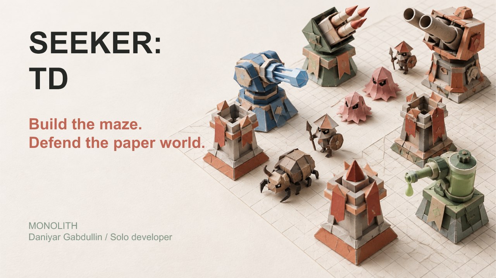
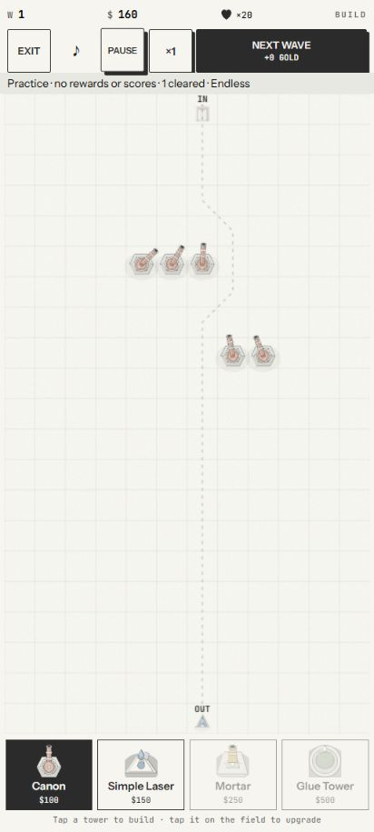
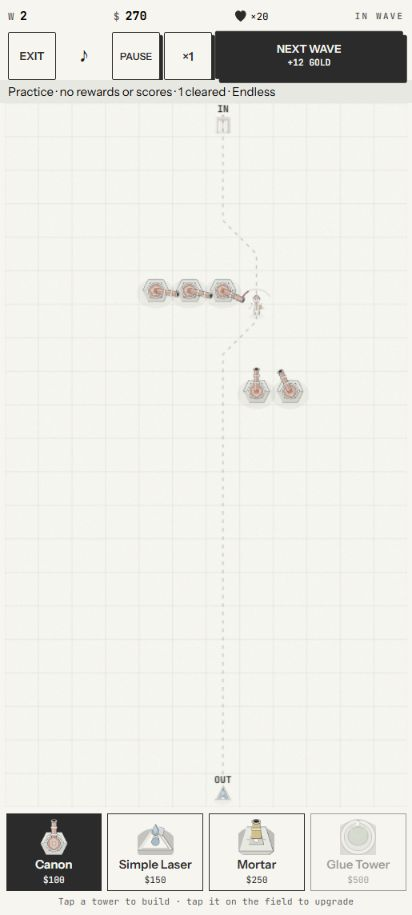

# SEEKER: TD

**Build the maze. Defend the paper world.**

A mobile-first tower-defense prototype for Solana Seeker, where your tower placements shape the enemy's route.

Local prototype. Purchases and payouts are disabled. STD is an internal in-game balance, not an on-chain token. Local ranked results are not verified prize competition.

## Presentation and gameplay

Prepared for a MONOLITH Seeker product presentation.

[View the presentation (PDF)](docs/pitch/SEEKER_TD_MONOLITH.pdf)

The cover is promotional concept artwork. The images below show the current playable prototype captured in a mobile-sized browser.

| Build your route | Defend against the wave |
| --- | --- |
|  |  |

## The game

Every placement changes the space enemies must cross. Extend their route while preserving useful firing positions, then combine tower effects as the waves grow.

- Place, upgrade and promote towers on an open grid.
- Combine damage and control effects across 12 tower models.
- Face 10 enemy types and a boss, with different movement and combat roles.
- Play endless, timed or wave-target modes.
- Learn the maze in unlimited practice without a wallet or entry debit.

### Tower roster

| Family | Towers |
| --- | --- |
| Bullet | Canon, Dual Canon, Machine Gun |
| Laser | Simple Laser, Bouncing Laser, Straight Laser |
| Explosive | Mortar, Mine Layer, Rocket Launcher |
| Control | Glue Tower, Glue Gun, Teleporter |

## Why Seeker and Solana

Seeker is the intended mobile audience. Touch controls support tower placement, inspection and wave management, while the paper figures give the board a distinctive visual identity.

Gameplay runs locally. Solana Mobile Wallet Adapter supports the Android wallet connection path, separate from combat and practice. Optional SOL run access is a planned extension that requires trusted backend verification. The Solana dApp Store is a future distribution goal; this game has no announced listing.

## Technology

The prototype uses React, TypeScript and Canvas rendering, packaged for Android through Capacitor. Wallet integration uses Solana Mobile Wallet Adapter. Separate local server experiments explore admission and deterministic replay; they are not a deployed game backend.

## Founder

**Daniyar Gabdullin, Solo Founder & Engineer.** Independently builds mobile and Web3 products since 2019; previously shipped Seeker Vault and X-Booster for Solana Seeker.

[Portfolio](https://portfolio.whoim.space) · [LinkedIn](https://www.linkedin.com/in/daniyar-gabdullin-11312b252/)

## Roadmap

1. Validate controls, visuals and performance on a physical Seeker.
2. Run a small gameplay pilot focused on route decisions and tower balance.
3. Complete backend verification and release preparation before any paid competition.
4. Prepare a Solana dApp Store submission.

## Repository scope

This initial showcase contains the README, PDF presentation, cover and gameplay screenshots; game source publication is pending license, asset-rights and secret review.

Repository: [who1900/seeker-td](https://github.com/who1900/seeker-td).

No license grant accompanies this initial showcase.
